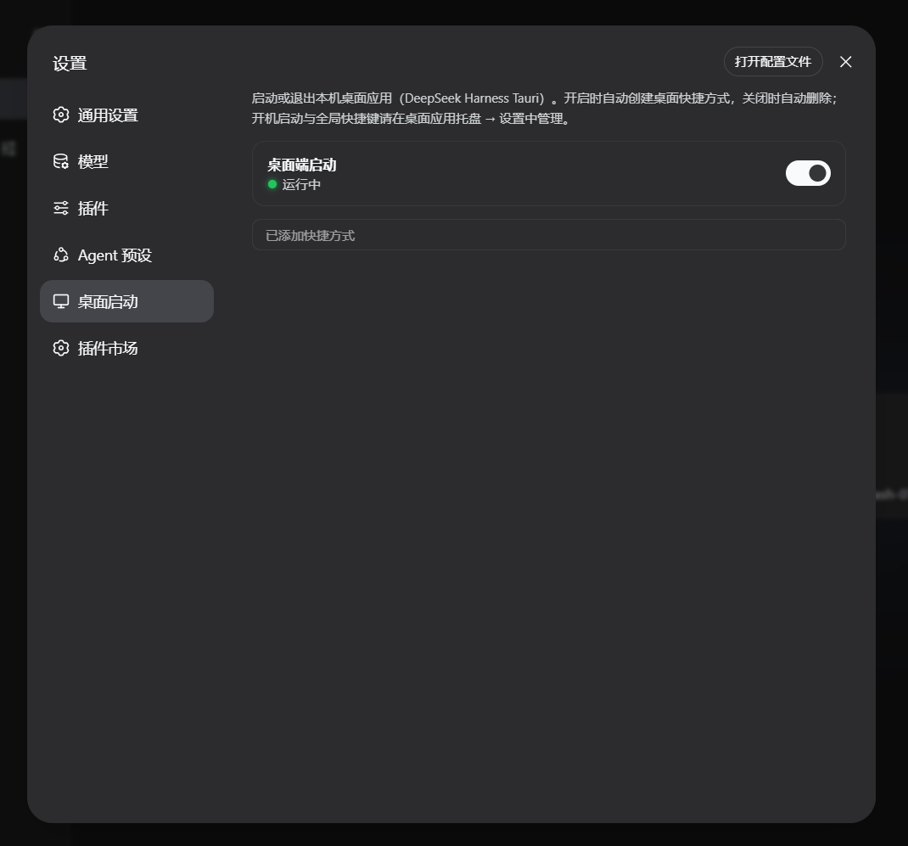
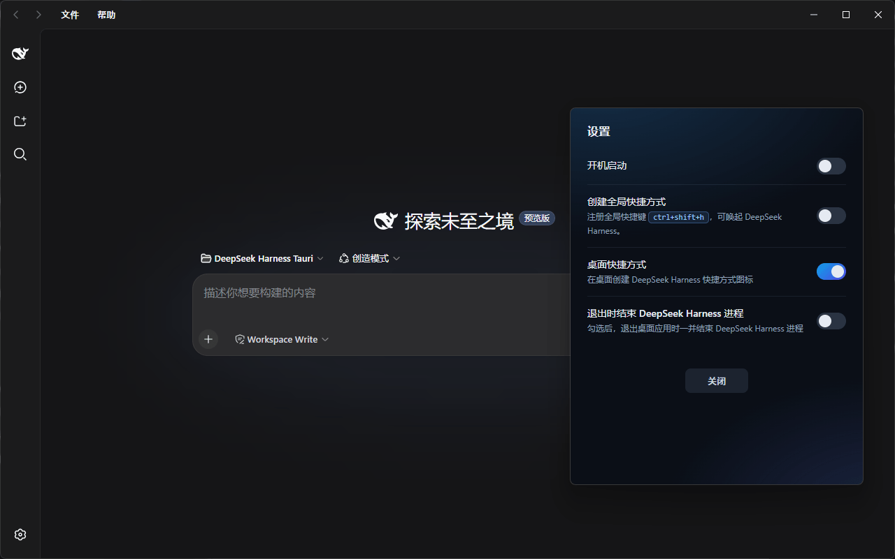

# DSH Tauri Launcher

<div align="right">

**[简体中文](./README.md)**

</div>

[](#platform-support)
[](LICENSE)

Following DeepSeek Harness's "everything-is-a-plugin" architecture, this project
abstracts desktop launch, exit confirmation, and desktop-shortcut management into a
standard Web plugin. From **Settings → Desktop Launcher** you can bring up the Tauri
desktop app in one click — enjoying both the deep integration of the plugin ecosystem
and a native desktop experience. The repository also ships the full Tauri desktop-app
source plus a GitHub Release automation pipeline.

## Platform Support

| Platform | Status                                |
| -------- | ------------------------------------- |
| Windows  | ✅ Supported (incl. `.lnk` shortcut)   |
| Linux    | 🚧 Planned                            |
| macOS    | 🚧 Planned                            |

The Web plugin core (host/client JS) is cross-platform; the Windows-specific pieces are
the desktop-shortcut creation and the loopback process-control implementation. Linux
and macOS support are on the roadmap — feel free to open an issue with your use case.

## Features

- **Desktop launch toggle**: one-click start/stop of the desktop app, with instant status feedback;
- **Shortcut integration**: auto-create a desktop shortcut on enable, auto-remove on disable; manual re-create is available while running;
- **Shutdown confirmation dialog**: confirmation popup before exit (with a notice that the shortcut will be removed);
- **Live status indicator**: running 🟢 / stopped ⚪ / unknown 🟡, plus diagnostic info on errors;
- **Dark-mode aware**: all colors flow through DSH theme tokens and adapt to light/dark automatically;
- **Custom settings icon**: replaces the default gear with a vector monitor icon (sharp at any size).

## Screenshots

<table>
<tr>
<td align="center" width="50%">

**Web settings panel (plugin section)**



After install, DSH Settings → Desktop Launcher shows the launch toggle, runtime status, and shortcut-link indicator.

</td>
<td align="center" width="50%">

**Desktop-app settings panel**



The Tauri desktop app's own settings: login autostart, global hotkey, desktop shortcut, and exit policy.

</td>
</tr>
</table>

## How It Works (Summary)

The Web plugin's host half talks to the browser half over `/api/dsh-tauri-launcher/*`
loopback routes, and controls the desktop app via a sentinel-file protocol (see
[docs/architecture.md](docs/architecture.md)):

- `.dsh-heartbeat`: the desktop app writes a timestamp every second; the plugin uses it to detect liveness;
- `.dsh-quit`: writing `1` makes the desktop app exit **only itself** (the Harness host process keeps running); the sentinel is self-deleting on consumption.

## Directory Layout

```
dsh-tauri-launcher/
├── README.md             # Chinese README
├── README.en.md          # English README
├── package.json          # dsh.bundle + dsh.client dual manifest
├── cordis.patch.yml      # composition patch (inserts the plugin row)
├── lib/
│   ├── index.js          # host half: loopback routes + control logic (configurable)
│   └── client.js         # browser half: settings section UI
├── launcher/             # Tauri desktop-app project (source + one-shot build; Windows only for now)
├── .github/workflows/    # CI: tag-driven Windows exe build + Release publish
└── docs/                 # architecture & release docs (Chinese)
    └── screenshots/      # screenshots referenced by the READMEs
```

## Install (Web Plugin)

> **About `<profile>`**: it refers to a DSH **profile** — a launchable plugin composition,
> located at `$DSH_HOME/profiles/<name>/`. `<profile>` is a placeholder; **replace it with
> the actual profile name you want to install into**. On most local setups the relevant
> profile is `web` (the profile that starts the DSH Web GUI). List existing profiles:
> `dir %USERPROFILE%\.dsh\profiles` (or `ls ~/.dsh/profiles`).
> In the commands below, swap `<profile>` for `web` — e.g. `dsh plugin --profile web add ...`.

Pick one of the three installation methods:

```bash
# 1) npm (after publish)
dsh plugin --profile web add @lenorin/dsh-tauri-launcher

# 2) GitHub (git install; pure JS, zero build, no allowBuilds grant required)
dsh plugin --profile web add github:you/dsh-tauri-launcher

# 3) Local checkout / tarball
dsh plugin --profile web add ./dsh-tauri-launcher
dsh plugin --profile web add ./dsh-tauri-launcher-1.0.0.tgz
```

> If you have multiple profiles, replace `web` in the commands with the target profile name.

Verify the plugin layer is active (you should see the `dsh-tauri-launcher` row):

```bash
dsh --profile web --dump-config
```

Restart the DSH Web process and the "Desktop Launcher" section appears under Settings.
Uninstall (replace `web` with your profile name):

```bash
dsh plugin --profile web remove @lenorin/dsh-tauri-launcher
```

## Configuration

The plugin row supports the following configuration keys (no hard-coded tunables; defaults
fit common deployments):

```yaml
- id: desktop-launcher
  name: '@lenorin/dsh-tauri-launcher'
  config:
    launcherExe: ''            # absolute path to the desktop-app exe; empty = auto-detect
    launcherDirs: []           # candidate exe directories; empty = built-in defaults
    freshSecs: 4               # heartbeat "freshness window" in seconds (must be > write interval)
    shortcutName: 'DeepSeek Harness.lnk'   # desktop-shortcut file name
```

## Desktop App Build & Release

- The npm package ships a pre-built exe (`launcher/bin/dsh-launcher.exe`); the plugin auto-detects it on install — ready to use out of the box;
- Local build: `pwsh -File launcher/build.ps1` (optional `-Offline -CargoHome <dir>`);
- GitHub Release: push a `v*` tag; CI auto-builds the Windows exe and publishes it
  (Linux/macOS builds are not enabled yet — see [docs/release.md](docs/release.md)).

## Documentation

- [docs/architecture.md](docs/architecture.md) — architecture & sentinel-file protocol (Chinese)
- [docs/release.md](docs/release.md) — install, build, release, uninstall & configuration reference (Chinese)

## License

[MIT](LICENSE)
